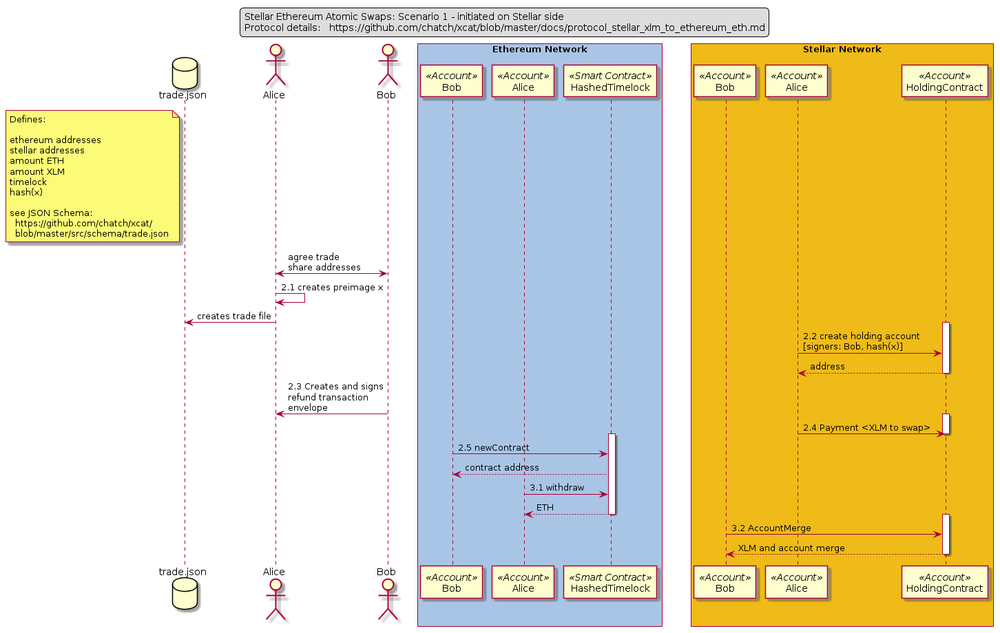

# Stellar XLM to Ethereum ETH Cross-chain Trades

Version: 0.1.3

This protocol supports atomic cross-chain trades between the native tokens of Stellar and Ethereum.

It is based on the [TierNolan protocol](https://bitcointalk.org/index.php?topic=193281.msg2224949#msg2224949)
but instead of using Bitcoin Script it uses Stellar
[hash(x) signers](https://www.stellar.org/developers/guides/concepts/multi-sig.html#hashx)
and
[time bounded transactions](https://www.stellar.org/developers/guides/concepts/transactions.html#time-bounds)
and for Ethereum a Solidity [hashed timelock smart contract](https://github.com/chatch/hashed-timelock-contract-ethereum/blob/master/contracts/HashedTimelock.sol).

Two scenarios are described below:
* Scenario 1 is initiated from Stellar.
* Scenario 2 is initiated from Ethereum.

### Note

* all hashes are SHA-2 SHA-256 hashes
* Ethereum HashedTimelock refers to
  [this Ethereum smart contract](https://github.com/chatch/hashed-timelock-contract-ethereum/blob/master/contracts/HashedTimelock.sol)
* 'Preimage' and 'x' are used interchangeably to refer to the generated secret preimage, the hash of which is used in the hashlocks
* 'HTLC' refers to Hashed Timelock Contracts

## Scenario 1 (S1): Trade initiated by XLM holder on Stellar

### Summary

* Alice is selling XLM to Bob
* Bob is selling ETH to Alice
* Alice initiates the setup process creating the secret preimage x
* Alice creates a holding account on Stellar to hold the XLM
* Bob creates a new HTLC on the Ethereum HTLC contract to hold the ETH
* Alice claims ETH revealing x to the HTLC contract on Ethereum
* Bob takes the revealed x and claims XLM from the Stellar holding account

### Sequence Diagram



### Protocol

1. Agreement
   1. Agree to terms over some channel (telegram, phone call, whatever ..) and define the amounts to trade
   2. Exchange Stellar and Ethereum public addresses. Each trader must have 1 account on each network
   3. Define trade details in a trade.json file that conforms to the [JSON schema](https://github.com/chatch/xcat/blob/master/src/schema/trade.json)
2. Setup
   1. Alice generates a secret preimage x
   2. [Stellar] Alice generates a new address for the holding account
   3. [Stellar] Alice creates holding account submitting this transaction:
   ```yaml
     source: Alice
     sequence: Alice current sequence
     operations:
       - type: createAccount
         destination: holdingAccount    # address created in 2.2 above
         balance: 4 * base_reserve      # 4 = 2 + signer hashx + signer bob
       - type: setOptions
         source: holdingAccount
         signer:
           - ed25519PublicKey: Bob
           - weight: 1
       - type: setOptions
         source: holdingAccount
         masterWeight: 0
         lowThreshold: 2
         medThreshold: 2
         highThreshold: 2
         signer:
           - sha256Hash: hash(x)
           - weight: 1
     sign: Alice
     sign: holdingAccount
   ```

   4. [Stellar] Bob creates a refund tx envelope and signs and sends it to Alice:
   ```yaml
     source: holdingAccount
     sequence: holdingAccount current sequence
     timebounds:
       - minTime: now + N minutes
       - maxTime: 0
     operations:
       - type: accountMerge
         destination: Alice
     sign: Bob
   ```

   5. [Stellar] Alice submits Tx moving agreed XLM into the holding account:
   ```yaml
     source: Alice
     sequence: Alice current sequence
     operations:
       - type: payment
         destination: holdingAccount
         asset: XLM
         amount: agreed amount
     sign: Alice
   ```

   6. [Ethereum] Bob calls newContract() on the HashedTimelock. This creates a
    new 32 byte HTLC id. Alice can scan the blockchain to retrieve this.
   ```yaml
     newContract:
       - _receiver: Alice's address (Ethereum)
         _hashlock: hash(x)
         _timelock: now + N / 2 minutes         # N from step 2.4 above
         options:
           - from: Bob
           - value: agreed amount
   ```

3. Trade

   1. [Ethereum] Alice claims ETH - calls withdraw() on the contract revealing x:

      ```yaml
       withdraw:
        - _contractId: <HTLC id>
          _preimage: x
      ```

   2. [Stellar] Bob claims XLM - now knows x and submits a transaction to Stellar to get funds:

   ```yaml
     source: holdingAccount
     sequence: holdingAccount current sequence
     operations:
       - type: accountMerge
         destination: Bob
     sign: Bob
     signHashX: x
   ```

NOTES:
1. If nothing happens after 2.5 Alice can get a refund after N minutes time has
   passed by adding a signature x to the transaction Bob gave here in 2.4.
2. If nothing happens after 2.6 Bob can get a refund after N / 2 minutes time
   has passed by calling refund() on the Ethereum smart contract.

## Scenario 2 (S2): Trade initiated by ETH holder on Ethereum

### Summary

* Alice is selling XLM to Bob
* Bob is selling ETH to Alice
* Bob initiates the setup process creating the secret preimage x
* Bob creates a new HTLC on the Ethereum HTLC contract to hold the ETH
* Alice creates a holding account on Stellar to hold the XLM
* Bob claims XLM in the holding account revealing x on Stellar
* Alice takes the revealed x and claims ETH from the HTLC on Ethereum

### Protocol

1. Agreement
 * same as in S1 1
2. Setup
   1. Bob generates secret x
   2. [Ethereum] Bob creates new HTLC on Ethereum getting a contract id:
    * same as 2.6 in S1 expect:
       * timelock is N minutes
       * it's Bob who knows x
   3. [Stellar] Alice sets up Stellar holding account:
    * same as in 2.2 and 2.3 in S1 except that signers are Bob and Alice (instead Bob and hash(x))
   4. [Stellar] Bob creates and signs a refund tx envelope for Alice:
    * same as in 2.4 in S1 except timelock is N / 2 minutes
   5. [Stellar] Alice submits a transaction moving agreed XLM into the holding account:
    * same as in 2.5 in S1
3. Exchange
   1. [Stellar] Bob claims XLM revealing x:
   ```yaml
     source: holdingAccount
     sequence: holdingAccount sequence
     operations:
       - type: accountMerge
         destination: Bob
     sign: Bob
     signHashX: x
   ```
   2. [Ethereum] Alice claims ETH - calls withdraw() (uses x from the last step)
   ```yaml
     withdraw:
       - _contractId: <HTLC id>
         _preimage: x
   ```

NOTES:
1. If nothing happens after S2 2.2 Bob can get a refund after timelock time has
   passed by calling refund() on the Ethereum smart contract.
2. If nothing happens after S2 2.5 Alice can get a refund after the timelock
   expires by signing the transaction Bob gave her in S2 2.4.
